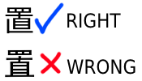

# Sửa lỗi phông chữ Tiếng Nhật & Gõ Tiếng Nhật

Bạn hãy nhìn vào chữ này: 置  
Kiểm tra xem máy bạn có đang bị lỗi phông chữ không:

(Nếu chữ 置 hiện giống như dòng có dấu tích thì đúng rồi đó. Còn nếu không thì bạn cần cài đặt thêm nhé).

Hướng dẫn này chủ yếu cho các máy tính dùng Hệ điều hành Windows. Nếu bạn không biết Hệ điều hành của bạn là gì, khả năng cao là bạn đang dùng Windows. Còn nếu bạn dùng MacBook thì sẽ là MacOS, còn nếu bạn dùng Linux thì bạn sẽ tự biết :D!

## Sửa lỗi phông chữ Tiếng Nhật

Cái này chủ yếu là trên Windows, bạn có thể đọc chi tiết hơn: [Cách cài bàn phím tiếng Nhật trên Windows 10](https://dekiru.vn/blog/detail-20200703084353528.htm). Hướng dẫn nhanh:

Nếu Windows của bạn không hiển thị được các ký tự tiếng Nhật ở các ứng dụng phổ biến, bạn cần cài đặt thêm gói ngôn ngữ và phông chữ cơ bản của hệ thống.

- Bước 1: Nhấn tổ hợp phím `Windows + I` để mở cửa sổ Settings (Cài đặt).
- Bước 2: Chọn **Time & Language** > chọn **Language & Region** (hoặc Language).
- Bước 3: Nhấp vào **Add a language** > tìm kiếm từ khóa `Japanese` > chọn Japanese (日本語) > nhấn **Next**.
- Bước 4: Tích chọn Optional features (hoặc Install language pack), đảm bảo có tích vào mục *Basic typing* > nhấn Install.

Hoặc xem video này:

<iframe width="560" height="315" src="https://www.youtube.com/embed/PJHtB29406s?si=LU0mUNyk-rQVy4E4" title="YouTube video player" frameborder="0" allow="accelerometer; autoplay; clipboard-write; encrypted-media; gyroscope; picture-in-picture; web-share" referrerpolicy="strict-origin-when-cross-origin" allowfullscreen></iframe>

## Gõ Tiếng Nhật

Bạn cần hoàn thành cài đặt ở trên xong rồi tiếp tục:

- Sau khi cài xong, ở góc dưới cùng bên phải thanh Taskbar, nhấn vào biểu tượng ngôn ngữ (ví dụ: ENG) và chuyển sang Japanese (hoặc nhấn phím tắt Windows + Space).
- Để bắt đầu gõ, hãy đảm bảo icon trên thanh Taskbar hiển thị chữ A (nhấp vào để đổi thành chữ あ - Hiragana)

Đây là trong trường hợp cài được như trên, nhưng nếu không cài được thì bạn nên làm như thế nào?

- Tải bộ gõ: Truy cập vào [Google Japanese Input](https://www.google.co.jp/ime/), bấm Accept and Install (Đồng ý và cài đặt). 
- Cài đặt (Tệp cài đặt mà bạn đã tải xuống): Chờ quá trình tải hoàn tất, mở tệp vừa tải về và cài đặt theo hướng dẫn trên màn hình.
- Kích hoạt và sử dụng:
    - Nhấn tổ hợp phím Windows + Space hoặc Alt + Shift để chuyển sang bộ gõ tiếng Nhật.
    - Để chuyển nhanh giữa gõ chữ Romaji (tiếng Anh) và chữ Hiragana (chữ Nhật), nhấn tổ hợp Ctrl + ~ (phím dấu ngã góc trên bên trái bàn phím).

## Còn cho MacOS với Linux thì sao

Nếu các bạn cần tìm hiểu thêm thì có thể đọc: [TheMoeWay - Japanese typing](https://learnjapanese.moe/ime/)

### MacOS

Mình cũng không biết nữa.

### Linux

Bạn không cần phải cài thủ công thì trường các Linux Distro đã hỗ trợ hết cho bạn rồi.

