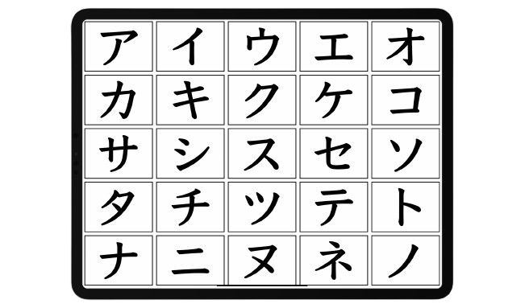
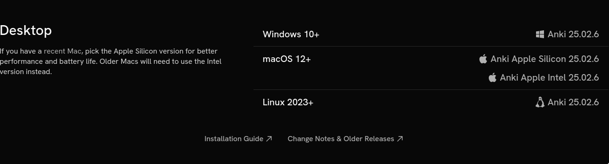
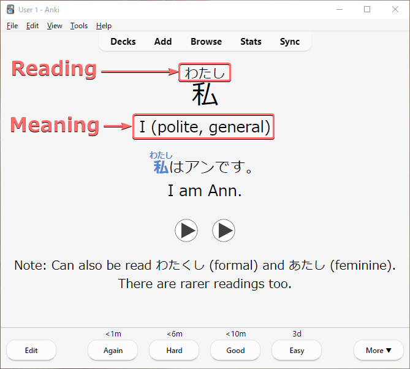

# Một hướng dẫn học Tiếng Nhật

*Nếu bạn không cần đọc phần mở đầu, hãy đến luôn phần **2.1 Cách để học Tiếng Nhật**.*

## 1.1 Nhiều người học ngoại ngữ "thất bại" do đâu?

Có một số lượng không nhỏ những người bắt đầu học Tiếng Nhật để có thể trải nghiệm nội dung bằng Tiếng Nhật hoặc để có thể nói Tiếng Nhật trôi chảy và một số các mục tiêu khác. Dù vậy, không ít người sau nhiều năm học vẫn không thể đạt được mục tiêu ấy. Do việc học ngoại ngữ quá khó? Hay do chưa đủ chăm?

Có lẽ vấn đề không phải nằm ở những người học ấy, mà là ở phương pháp. Trong việc học ngôn ngữ, phương pháp học của bạn tạo ra sự khác biệt rất lớn trong khả năng và tốc độ tiến bộ ngoại ngữ của bạn.

Khó có thể đạt được những mục tiêu như vậy chỉ với các phương pháp học ngoại ngữ truyền thống. Nhiều người "thất bại" vì thiếu vào một phần quan trọng, **immersion**, trong quá trình học tập. **Immersion** để chỉ việc nghe hoặc đọc nội dung của người bản ngữ dành cho người bản ngữ. 

Ví dụ: Xem Anime (Lồng Tiếng Nhật) Không sử dụng phụ đề là một cách ta thực hiện immersion Tiếng Nhật.

## 1.2 Vấn đề của phương pháp học truyền thống

{:  style="display: block; margin: 0 auto; max-width:40%; height:auto;" }  

Học ngoại ngữ theo phương pháp "truyền thống" thì thường sẽ kiểu như này:

-   Học bảng chữ cái.
-   Học các câu cơ bản như câu chào hỏi, tự giới thiệu.
-   Học cấu trúc ngữ pháp và từ vựng cơ bản.
-   Nghĩ ra câu bằng cách trò chuyện với giáo viên hoặc bạn học hoặc bằng cách viết.
-   Dịch các câu ví dụ từ Tiếng Việt sang ngôn ngữ đích (TL - Target Language) và ngược lại.
-   Tra cứu thêm tài liệu về cấu trúc ngữ pháp và từ vựng trong sách giáo khoa hoặc xem video YouTube
-   Thực hành hội thoại sử dụng kiến thức đã học.
-   Tích lũy thêm nhiều cấu trúc từ vựng và ngữ pháp và lấy số lượng làm thước đo cho sự tiến bộ của bản thân
- Và cuối cùng là đến giai đoạn cuối, chuyển đến sống hoặc đi du lịch Nhật Bản với hy vọng có cơ hội rèn luyện kỹ năng của mình.

Bản thân việc học như này hoàn toàn ổn, nhưng chưa đủ để giúp bạn đạt được trình độ cao. Vấn đề là những người học thuộc nhóm trên không tương tác với ngôn ngữ thực tế.

Lấy bơi lội làm ví dụ: Bạn không thể chỉ mãi ở hồ dành cho trẻ con, đeo phao và hy vọng rằng mình sẽ thành thạo kỹ thuật bơi trong cái hồ đó trước khi bước sang hồ lớn. Làm vậy sẽ không bao giờ khiến bạn trở thành một người biết bơi thực thụ. Cũng giống như bạn không thể trở thành vận động viên bơi lội chỉ bằng cách học lý thuyết và luyện động tác trên cạn, mà không bao giờ nhảy xuống nước thật.

Một ví dụ dễ liên hệ hơn: game đối kháng. Bạn sẽ không thể chơi giỏi chỉ bằng cách luyện với máy hoặc tập trong chế độ huấn luyện cả ngày. Muốn giỏi, bạn phải bước vào trận đấu thực sự – chơi với người thật, chấp nhận rằng mình có thể thua tơi tả. Đó mới là “chơi thật”.

  Điều quan trọng là: phải học cách bước tiếp

Người mới học thường mắc một cái bẫy là cố gắng học tài liệu cho đến khi hiểu hết mới thôi và không thực hiện immersion vì chưa cảm thấy thoải mái hay "sẵn sàng". Tuy nhiên, cần ngừng sử dụng tài liệu cho người mới học càng sớm càng tốt vì trên thực tế, bạn sẽ không bao giờ cảm thấy sẵn sàng nếu không bắt đầu tiếp xúc với ngôn ngữ thực tế và làm quen với nó.

Chủ nghĩa cầu toàn có thể là con dao hai lưỡi trong việc học ngôn ngữ. Tốn quá nhiều thời gian và công sức mà không đạt được nhiều kết quả, cố ghi nhớ từng chi tiết nhỏ nhất của những thứ không thực sự quan trọng trong cả quá trình học dài đấy.

Học một ngôn ngữ giống như leo núi vậy. Bạn có thể cố gắng leo mà không dùng đến bất kỳ công cụ hỗ trợ nào – và dù sẽ rất vất vả, nếu kiên trì, bạn vẫn có thể đến đích. Việc học theo cách truyền thống giống như đang bện một sợi dây thừng để việc leo núi dễ hơn. Nhưng bạn không thể chỉ ngồi đó bện dây mãi – đến một lúc nào đó, bạn phải bắt đầu leo. Dù bạn có làm ra bao nhiêu dây đi nữa, thì việc leo núi vẫn sẽ khó khăn và tốn thời gian. Không có đường tắt – bạn phải thực sự bắt tay vào *làm*.

## 1.3 Quy mô của ngôn ngữ

Ngôn ngữ thực sự quá rộng lớn. Có quá nhiều thứ vượt xa ranh giới trong một lớp học hoặc phương pháp dạy theo kiểu "x có nghĩa là y" (A is B) hoặc "x thực hiện hành động y" (A does B). Để thành thạo một ngôn ngữ ở cấp độ cao cần một lượng lớn "đọc" và "nghe" nội dung ngôn ngữ đích.

Và thường thì rất khó để hiểu tại sao họ lại dùng *câu đó* trong *tình huống kia*, hay *từ này* thay vì *từ kia*. Điều đó tạo nên một rào cản lớn cho người học – bởi vì bạn không thể chỉ học mỗi ngữ pháp và từ vựng mà mong nói được như người bản xứ.

Nếu không có những trải nghiệm cần thiết, việc cố gắng tự tạo câu ở ngôn ngữ mục tiêu thường khiến cho cách diễn đạt trở lên thiếu tự nhiên hoặc khó hiểu. Thêm nữa, việc không hiểu hoặc chưa hiểu rõ cách người bản ngữ sử dụng ngôn ngữ của họ khiến việc hiểu họ trở nên khó khăn hơn rất nhiều do không quen với cách diễn đạt bên ngoài phạm vi của tài liệu học tập.

Đây là lý do tại sao trong việc học ngoại ngữ cần có **"immersion" - đọc và nghe những gì người bản ngữ viết và nói.**

Học ngôn ngữ là một quá trình ghi nhớ các pattern (mẫu) trong vô thức thông qua comprehensible input. Điều này có nghĩa là, khi bạn hiểu điều gì đó (comprehensible) trong quá trình immersion, bộ não của bạn sẽ vô thức lưu mẫu (pattern) đó vào trong đầu để có thể sử dụng trong tương lai. Nó sẽ kiểu như: "Ê mày, có mẫu số 234 được sử dụng với mẫu số 82 và mẫu số 10 kìa".

Tại sao lại không nói về "biết ngữ pháp" hay "nhớ từ vựng"? Bởi đây không phải là cách xử lý ngôn ngữ tự nhiên. Một số người không phải là người bản ngữ Tiếng Anh và có thể là đã học ngữ pháp Tiếng Anh từ trước, nhưng họ sẽ chẳng mấy khi nghĩ về các cấu trúc ngữ pháp khi tương tác với Tiếng Anh hàng ngày.

## 1.4 Chấp nhận cảm giác khó chịu và mù mờ

{:  style="display: block; margin: 0 auto; max-width:40%; height:auto;" }  

Trong việc học ngôn ngữ hay trong bất cứ lĩnh vực nào đòi hỏi kỹ năng, bạn sẽ luôn gặp khó khăn trong một thời gian dài cho đến khi bạn tiến bộ hơn. Như đã nói ở trên, nhiều người học (mình cũng đã từng như vậy) cứ cố gắng học thật tốt một thứ gì đó trước khi sử dụng chúng trong thực tế.

Ví dụ, một người học khi cố học một cấu trúc ngữ pháp nào đó quá lâu và không chuyển sang những nội dung khác mà họ nên học.

<h3>↑ Đây là điều chúng ta cần tránh</h3 >  

Không dễ dàng gì để có thể hiểu hết quyển light novel hay một bộ anime ngay lần đầu. Cần tới lần thứ ba, thứ tư, thứ năm và thậm chí thứ sáu để có thể học được điều gì đó.

## 1.5 "Immersion" là cái gì?

Immersion là khi bạn tương tác với nội dung tự nhiên bằng ngôn ngữ mục tiêu (ở đây là Tiếng Nhật). Là nội dung KHÔNG hề được làm hoặc chọn lọc kỹ càng cho người học mà được làm bởi chính người bản ngữ cho người bản ngữ.

Nếu bạn là người học Tiếng Anh (bài viết gốc được viết bằng Tiếng Anh), việc đọc hướng dẫn này ngay bây giờ sẽ được tính là bạn đang "thực hành immersion Tiếng Anh", bởi vì hướng dẫn này không hề được đơn giản hóa hay giúp cho người học Tiếng Anh. Nó được viết cho những người nói Tiếng Anh ở mức độ bản ngữ/thành thạo. Vì vậy, khi bạn nghe hoặc đọc nội dung Tiếng Nhật mà người Nhật cũng thường sử dụng, bạn đang thực hành immersion.

Theo thuật ngữ thì được gọi là *input*, nhưng mình thích dùng *immersion* hơn.

## 1.6 Cách tiếp cận "từ trên xuống" (top-down) trong việc học ngôn ngữ

Việc học một ngôn ngữ yêu cầu bạn phải hài lòng với việc không hiểu tất cả mọi thứ.

Điều này hoàn toàn khác so với cách học ở trường lớp, nơi chủ nghĩa hoàn hảo được tuyên dương dựa trên thành tích học và được xếp loại thông qua các tiêu chí hoặc các kỳ thi. 

Những người học ở trên dễ cảm thấy nản vì không hiểu được tất cả hoặc phần nhiều khi tương tác với ngôn ngữ thực tế, cho dù đó là một bộ phim truyền hình, hay một quyển sách hoặc thậm chí chỉ là một cuộc hội thoại bình thường với người bản ngữ. Việc tiếp tục như vậy khi bạn hiểu rất ít nghe có vẻ không hợp lí, nhưng như đã nói ở các phần trước, học một ngôn ngữ cũng giống như nhảy vào hố sâu bất tận vậy.

Điều khiến việc học ngôn ngữ trở nên quá đỗi khác biệt so với các môn học ở trường là nó dựa trên việc sử dụng ngôn ngữ một cách tự nhiên và thực tế, thứ mà tài liệu học tập không thể truyền tải được. Vì vậy, cách duy nhất để làm quen với mọi thứ là chấp nhận sự mù mờ (low comprehension - độ hiểu thấp), vì càng tương tác với ngôn ngữ nhiều thì sẽ càng tiến bộ hơn.

Tất nhiên, chúng ta không *chỉ* thực hiện immersion mà không làm gì khác. Cũng cần học những thứ như ngữ pháp và từ vựng. Đồng thời, sử dụng từ điển để học từ trong quá trình immersion.

## 2.1 Cách học Tiếng Nhật

### Quá trình học tập ban đầu

Quá trình học tập mở đầu bao gồm bao gồm:

-   Học bảng *Hiragana* Và *Katakana*, đó là hai bảng chữ cái cơ bản của Tiếng Nhật.
-   Học từ vựng cơ bản và *Kanji* sử dụng *Anki*.
-   Học ngữ pháp thông qua một danh sách phát trên *YouTube*.
-   Bắt đầu immerse với comprehensible input cường độ cao. Đây là nhiệm vụ mà bạn cần dành phần lớn thời gian.

## 2.2 Hiragana và Katakana

<figure>
  
  <figcaption>"Hiragana" và "Katakana"</figcaption>
</figure> 

*Hiragana* và *Katakana* là hai phần của hệ thống viết trong Tiếng Nhật với phần thứ ba là *Kanji* (Kanji)

Hệ thống chữ viết của Tiếng Nhật có thể được mô tả giống như một "âm tiết" hơn là một chữ cái. Về mặt thuật ngữ, dùng từ "bảng chữ cái" là sai vì mỗi ký tự đại diện cho một âm tiết chứ không phải là nguyên âm hoặc phụ âm. Lấy ví dụ, 「か」, đọc là "ka".

*Hiragana* và *Katakana* được gọi chung là "**Kana**".

*Hiragana* và *Katakana* đại diện cho mọi âm trong Tiếng Nhật. Tuy có thể viết Tiếng Nhật hoàn toàn bằng *Kana* nhưng đây không phải là cách viết Tiếng Nhật thường được viết vì nó còn bao gồm cả *Kanji* nữa.

### Hiragana

 

*Hiragana* được coi như "bảng chữ cái chính" của Tiếng Nhật. Là một biến thể cong và "dễ thương" của *Kana*.

Thường được sử dụng trong:

-   Những thứ liên quan đến ngữ pháp
-   Các phần từ có gốc Tiếng Nhật
-   Những từ thường không được viết bằng *Kanji*

Nó cũng có thể được sử dụng trong tên.

### Katakana

*Katakana* thì trông góc cạnh và nhọn. Nó có âm giống như *Hiragana*. Thường được sử dụng trong:

-   Từ mượn từ nước ngoài (Từ các ngôn ngữ khác như Tiếng Anh)
-   Từ tượng thanh (Tiếng Nhật có rất nhiều từ như này)
-   Tiếng lóng

Nó cũng có thể được sử dụng trong tên (nhưng chủ yếu là tên nước ngoài).

### Cách học Kana

#### Bước 1 - Sử dụng biểu đồ

Đọc sơ đồ này.

Biểu đồ này sẽ rất hữu ích khi học *Kana*, bạn nên lưu lại.

Sử dụng biểu đồ này để:

-   Tập đọc *kana* bằng cách tham khảo bảng. Các cột thể hiện nguyên âm và các hàng thể hiện phụ âm. Vì 「か」 nằm ở hàng K và cột A nên được phát âm là "ka".
-   Tìm hiểu cách viết chúng bằng cách nhìn vào thứ tự các nét (mũi tên nhỏ màu xanh và số trên các ký tự).
-   Sử dụng nó như một tài liệu tham khảo chính cho tất cả các số ít *kana*. Điều này sẽ giúp ích cho bạn rất nhiều khi bạn học đọc Tiếng Nhật.

#### Bước 2 - Xem Video trên YouTube

<h4><a href="https://youtu.be/_wZHqOghvSs" target="_blank">Xem video YouTube này (2 giờ)</a></h4>

1 video 2 tiếng giới thiệu về *Hiragana* Và *Katakana*.

#### Bước 3 - Cày
Làm xong bước số 2 thì chơi "game" này để ôn tập

<h3><a href="https://gohoneko.neocities.org/learn/kana" target="_blank">Game cày Kana</a></h3>

<h4>Cách cày</h4>

1.  Nhấp vào "show/hide options".
2.  Nhấp vào "check all" cho *Hiragana*.
3.  Bắt đầu kiểm tra *Hiragana* *phát âm* như thế nào.
4.  Lặp lại cho đến khi cảm thấy tự tin về chủ đề này (có thể mất vài ngày hoặc vài tuần), sau đó thực hiện tương tự nhưng với tất cả "kết hợp Hiragana" cũng được chọn.
5.  Lặp lại cho đến khi tự tin, sau đó thực hiện tương tự với bảng "Katakana" và sau đó nữa là "Katakana combinations".

Toàn bộ quá trình này có thể mất tới 3 tuần đến một tháng tùy theo từng người. Đừng cảm thấy nản nếu phần học này của Tiếng Nhật mất thời gian, vì còn có những việc khác mà ta cần làm chẳng hạn như immersion ở cấp độ mới bắt đầu.

#### Bước 4 - Luyện đọc

Việc đọc các câu bằng Kana cũng sẽ giúp bạn ghi nhớ chúng.
Không phải mọi thứ trong Tiếng Nhật đều được viết bằng Kana và bạn sẽ gặp khó khăn khi cố đọc hầu hết mọi thứ vào thời điểm này mà không có kiến thức về *kanji*, nhưng đôi khi trong Tiếng Nhật, Kana được hiển thị trên *kanji* để giúp bạn đọc. Cái này được gọi là *furigana*. Một ví dụ:
<ruby>
  日本語<rp>(</rp><rt>にほんご</rt><rp>)</rp>
</ruby>. 
Từ này có nghĩa là Tiếng Nhật ("nihongo"). mình đã viết nó bằng *kanji* hình thức và đặt *hiragana* trên đó.

Bạn nên thực hành *kana* bằng cách thử đọc [Tadoku](https://tadoku.org/japanese/free-books/#l0).

<strong><h3>Bạn chưa cần phải hiểu bất cứ điều gì ngay bây giờ. Mục tiêu chính ở đây là giúp bạn cải thiện khả năng đọc Kana.</h3></strong> 

## 2.3 Từ Vựng & Kanji

### Kanji

_80 chữ Kanji đầu tiên mà các học sinh lớp 1 ở Nhật Bản cần học_.

*Kanji* hay "Hán tự", là một hệ thống chữ viết khác được sử dụng trong Tiếng Nhật. Chúng có tính biểu tượng, phức tạp hơn và đa dạng hơn nhiều so với *kana*. Có khoảng 2000 đến 3000 trong số đó được sử dụng trong Tiếng Nhật, tuy nhiên, đừng để con số này làm bạn nản, bởi vì cách học của *Kanji* không tương tự như *kana*.

*Kana* thì **nhất quán về mặt ngữ âm** và số lượng ít nên ta có thể học riêng và thành thạo trong một khoảng thời gian ngắn nhưng với *Kanji* thì không. Chúng cũng không được sử dụng theo cùng một cách và không hoàn toàn logic. Điều này nghĩa là gì?

Vì *Kana* đại diện cho các âm trong Tiếng Nhật, chúng ta có thể viết bất cứ điều gì chúng ta muốn tùy theo âm đó miễn là có âm Kana tương ứng cho nó, điều này bao gồm cả việc viết các từ Tiếng Anh.

Bây giờ hãy tưởng tượng cách phát âm **Tiếng Anh** của câu "mình đang học Tiếng Nhật" nhưng sử dụng *Kana*, thử đọc xem:

> "あい あむ らあにんぐ じゃぱにいず"

Tất nhiên, cái này khá là *bất ổn* và không có lý do gì bạn lại muốn làm điều này, nhưng luận điểm ở đây là: bạn không thể viết kiểu như này nếu sử dụng Kanji (Kể cả "viết được" thì đọc cũng sẽ rất là dị). Nhưng tại sao sau đó chúng ta lại sử dụng Kanji? **Vì từ vựng.** Các từ sử dụng Kanji, vậy nên..

Kanji chỉ có ý nghĩa khi chúng được sử dụng trong từ vựng.

Mình nhắc lại:

  Kanji chỉ có ý nghĩa khi chúng được sử dụng trong từ vựng.

 

Ngôn ngữ nào cũng có **nhiều** từ và các từ khác nhau có nghĩa khác nhau. Tiếng Trung và Tiếng Nhật vì lý do trời ơi đất hỡi gì đó đã quyết định sử dụng Kanji để ghép các từ khác nhau và ý nghĩa khác nhau của chúng lại với nhau. Đó là lý do tại sao lại có rất nhiều từ vựng như vậy và bạn không nên sợ Kanji vì bạn sẽ học được Kanji thông qua từ vựng.

<!-- Suy cho cùng, sẽ không ai nghĩ đến việc tải trước tất cả các từ trước khi học cách đọc!  -->

  Kanji không phải là từ vựng, mà là nền tảng

 

Có những bước thêm khi học đọc Tiếng Nhật; do Kanji nên bạn cần phải liên tục tra từ điển để học cách đọc bất cứ thứ gì.

Lấy ví dụ này, nếu mình cho bạn xem từ, **今日**, rất có thể bạn sẽ không thể đọc được nó hoặc biết nghĩa của nó là gì. Cách bạn học cách đọc là tra từ trong từ điển, chẳng hạn như [Mazii](https://mazii.net/).

Theo từ điển, nó được đọc là **きょう**, và có nghĩa là *hôm nay*. Nếu chúng ta phải tra từ này trong khi đọc thứ gì đó, chúng ta sẽ tiếp thu chúng và tiếp tục. Cách này khá chán. Nhưng có những công cụ như [Yomitan](yomitan.md) có thể giúp bạn thực hiện điều này chỉ với một lần di chuột.

### Về việc học Kanji đơn lẻ

Phương pháp học Kanji từ lâu đã là một vấn đề gây tranh cãi. Một trong những vấn đề thường thấy trong quá trình học của người mới bắt đầu là họ thấy có những Kanji trông quá giống nhau và các nét trông quá rối.

Dù Kanji trông giống như những hình thù ngẫu nhiên, chúng được hình thành từ các bộ thủ phổ biến. Lấy ví dụ Kanji **萌**, biểu tượng của trang này, được tạo thành từ 3 thành phần Kanji phổ biến khác được sử dụng trong nhiều Kanji khác.

   

Những người đang gặp khó khăn trong việc phân biệt các Kanji có thể thử học Kanji đơn lẻ theo các bộ thủ. Bạn có thể sử dụng một *bộ thẻ Anki* bổ sung (sẽ được giải thích trong phần tiếp theo) để hỗ trợ quá trình học này, tải [bộ thẻ này](https://mega.nz/file/2SJiWC4b#hL98qtC_hiLlQDg0LqVJoqD2-5ywT2Nwd4kjROY_KwQ)

## 2.4 Học từ vựng

Để hiểu được Kanji và cách chúng được sử dụng cùng nhau trong từ, bạn nên học bộ thẻ từ vựng Anki dành cho người mới bắt đầu. Dưới đây là một bộ thẻ bao gồm khoảng *1500* từ, giúp bạn học những từ Tiếng Nhật thông dụng nhất để khởi đầu quá trình học Tiếng Nhật của mình.

### Cài đặt Anki nhanh

Anki là một phần mềm flashcard được thiết kế để giúp bạn ghi nhớ lượng lớn thông tin, chẳng hạn như từ vựng. Bạn hãy truy cập vào [Trang tải xuống của Anki](https://apps.ankiweb.net/), và tải phiên bản Anki cho hệ thống của bạn (Windows, MacOS, Linux) và chạy tệp cài đặt.

Khi mở Anki lần đầu tiên bạn sẽ được yêu cầu cài đặt ngôn ngữ hiển thị, hãy đặt theo mặc định (English). 

Bộ thẻ dành cho người mới bắt đầu mà mình gợi ý là [Kaishi 1.5k](https://github.com/donkuri/Kaishi/releases) có thể tải xuống thông qua [đường dẫn này](https://github.com/donkuri/Kaishi/releases) (chọn tệp có đuôi `.apkg`) (Bộ thẻ đã có bản dịch Tiếng Việt: [Kaishi1.5K Tiếng Việt](https://github.com/thu-tram/kaishi-vi/releases))

Sau khi quá trình tải xuống hoàn tất, hãy thêm bộ thẻ vào Anki bằng cách chọn "Import file" và điều hướng đến chỗ mà bạn đã tải tệp xuống (.apkg) rồi chọn "Import" ở trên cùng bên phải.

### Hướng dẫn sử dụng Anki nhanh

Trước khi bắt đầu học, bạn nên thay đổi một số cài đặt. Nhấp vào biểu tượng răng cưa bên cạnh bộ thẻ và tiếp tục *Options*.

Thay đổi *Maximum reviews/day* từ `200` ĐẾN `9999`. Đừng lo lắng về con số này, số lượng Reviews (Thẻ bạn cần ôn tập trong Anki) của bạn có thể sẽ không bao giờ đạt đến mức cao như vậy, nó chỉ giúp bạn vượt qua giới hạn review hàng ngày để có trải nghiệm tối ưu.

Đối với *New cards/day*, `20` có thể hơi quá khó với một số người. Nếu bạn cảm thấy áp lực khi học 20 từ mới mỗi ngày, hãy thử giảm con số xuống còn `10` hoặc thấp hơn.

Khi bạn bắt đầu học bộ thẻ *Kaishi 1.5k*, thẻ đầu tiên là thẻ giới thiệu bộ thẻ. Bạn có thể xóa thẻ này bằng cách chọn "More" và chọn "Delete Note"

Anki giúp bạn ghi nhớ mọi thứ bằng cách kiểm tra khả năng nhớ nội dung ở mặt sau thẻ. Kiểm tra xem liệu bạn có biết nghĩa và cách đọc từ đó hay không. Mọi thứ khác trên thẻ chỉ để hỗ trợ bạn trong quá trình học.

Hãy nhớ là dù *Kaishi 1.5k* có các câu ví dụ, nó chỉ được thiết kế để học từ vựng đơn lẻ.

Khi thấy một thẻ Anki bạn chưa học (thẻ mới), nên chọn *Show Answer* để có thể thấy những gì ở mặt sau của thẻ.

Khi đã xem xong nội dung thẻ rồi, hãy nhấn *Again* (Bằng với việc "Ôn lại"). Với những thẻ tiếp theo, hãy làm tương tự vì đây cũng là thẻ mà bạn thấy lần đầu.

Lần tiếp theo bạn nhìn thấy thẻ đó là khi kiểm tra lại nội dung mặt sau của thẻ. Hãy cố gắng hết sức để nhớ lại nghĩa và cách đọc ở mặt sau thẻ và tự chấm điểm!

Về cơ bản, đây là cách chúng ta học từ vựng ở giai đoạn mới bắt đầu.

Khi bạn đã hoàn thành các thẻ mới trong ngày, hãy nhớ quay lại vào ngày hôm sau để ôn tập lại các từ đã học.

## 2.5 Ngữ pháp

Việc học ngữ pháp tương đối quan trọng trong việc học Tiếng Nhật. Có rất nhiều tài liệu ngữ pháp ngoài kia, tốt cũng có mà không tốt cũng có. Chỉ có một nguồn học ngữ pháp là không đủ cho tất cả mọi người.

Dưới đây là một số hướng dẫn được xếp hạng dựa trên mức độ gợi ý cho những người mới bắt đầu. Không cần phải học từng hướng dẫn một, chỉ cần chọn một hướng dẫn mà bạn thấy phù hợp với bản thân:

[Cure Dolly's Organic Japanese YouTube Playlist](https://www.youtube.com/playlist?list=PLg9uYxuZf8x_A-vcqqyOFZu06WlhnypWj)  
[Tae Kim's Guide to Japanese](https://gohoneko.neocities.org/grammar/taekim)  
[Japanese Ammo with Misa Grammar YouTube Playlist](https://www.youtube.com/playlist?list=PLd5-Wp_4tLqYZxS5j3g6kbeOfVXlTkr3N)    
[Sakubi](https://gohoneko.neocities.org/learn/anon/sakubi)  
[IMABI](https://imabi.org/)

(Không tìm được hướng dẫn bằng Tiếng Việt nào ổn cả ;-; Khi nào gợi ý thêm sau)

Đây là thời điểm tốt nhất để bắt đầu immersion khi bạn đã học được một số cấu trúc ngữ pháp mới. Xem cách áp dụng ngữ pháp đã học vào thực tế sẽ giúp bạn hiểu rõ hơn về chúng.

## 2.6 Immersion cho tân thủ

Ở phần 1.3, mình đã nói về comprehensible input. Đây là input mà bạn có thể hiểu được, cứ mỗi vài câu lại có một số mảnh ghép bị thiếu. Với kiểu immersion này, trong tiềm thức bạn sẽ tự điền thêm vào những phần bạn thấy chưa hiểu bằng cách đoán ý dựa trên ngữ cảnh, đó là lý do tại sao kiểu input này lại vô cùng hữu ích cho việc học ngôn ngữ.

Nhưng có một vấn đề. Bạn sẽ làm gì nếu không có nguồn comprehensible input? Là người mới bắt đầu, không có nội dung nào là dễ cả. Trên thực tế, đây là lý do tại sao mọi người thường lạc lối và bắt đầu đọc từ tài liệu này sang tài liệu khác. Mặc dù incomprehensible input cũng có những tác dụng nhất định và hỗ trợ cho việc học, nhưng sẽ rất khó để có thể vượt qua rào cản ban đầu ấy.

Việc không hiểu được nội dung mình muốn tiêu thụ khá khó chịu, trừ khi bạn có một hướng tư duy cụ thể về nó - cảm thấy vui khi biết rằng mình đang tiến bộ dần dần kể cả khi khó có thể thấy một cách rõ rệt. Tuy nhiên, để duy trì tư duy này mọi lúc không hề dễ dàng, không nên dựa vào nó để làm động lực thúc đẩy cho sự kiên trì trong học tập - chìa khóa số một để thành thạo bất kỳ kỹ năng nào.

Vậy làm cách nào để không phải cảm thấy áp lực khi phải tiêu thụ các nội dung khó hiểu?

Chọn những gì bạn thích. Media thực sự khá giải trí vì nhiều lý do khác nhau khác ngoài việc học ngôn ngữ. Bằng cách chọn Media có tính giải trí, thư giãn và có giá trị cao bất kể cấp độ ngôn ngữ nào, chúng ta có thể duy trì liên kết của bản thân với ngôn ngữ và có động lực để tiếp tục immerse. Dần dần, khi trải nghiệm ngôn ngữ phát triển, chúng ta sẽ thấy mình hiểu nhiều hơn và mục tiêu từng tưởng chừng như không thể đó là tìm comprehensible input giờ đây đã trở thành một điều hiển nhiên, với mục tiêu mới là tiếp tục tìm những nội dung khó hơn để thúc đẩy bản thân tiếp tục học. 

## 2.7 Cách immerse

### Đọc & Từ điển

Để giúp cho việc đọc Tiếng Nhật trở lên dễ dàng hơn thì có thể Yomitan trên trình duyệt. Đọc [hướng dẫn tải xuống](yomitan.md) 

Để tra cứu từng từ riêng lẻ, bạn có thể sử dụng [Mazii.org](http://mazii.net/), ứng dụng cho điện thoại thì có [Mazii](https://play.google.com/store/apps/details?id=com.mazii.dictionary) cho Android và [Mazii](https://apps.apple.com/us/app/mazii-dict-to-learn-japanese/id933081417) cho iOS.

### Lựa chọn nội dung Immersion

Chọn bất cứ nội dung gì bạn muốn. Nó có thể là Anime, phim, J-Drama, tiểu thuyết, light novel, manga, visual novel, game hoặc YouTube. Chỉ cần bạn thích bất cứ thứ gì bạn chọn cho việc immersion của bản thân là được.

### Cách để thực hiện Listening Immersion 

Chúng ta không muốn suy nghĩ quá nhiều về mọi thứ khi đang nghe. Thả mình theo dòng chảy (flow) cho đến khi bạn nghe thấy thứ mà bạn muốn tra.

Có một số cấp độ nhất định khi nghe. Cấp độ một sẽ là nghe free-flow, nghe theo flow mà không tra từ. Cấp độ hai sẽ là tra những phần bạn muốn tra nhưng vẫn để bài nghe chạy. Cấp độ ba sẽ dừng ở mỗi từ chưa biết và tra.

Ở giai đoạn sơ cấp đến trung cấp, kỹ năng nghe hoàn toàn nằm ở cấp độ một và cấp độ hai. Đừng suy nghĩ quá nhiều về điều đó và hãy để ý tất cả những cơ hội nhỏ mà bạn bắt được trong khi nghe.

#### Nghe "chủ động" và "thụ động"

Nghe chủ động là khi bạn tập trung hoàn toàn vào việc nghe của mình. Bạn đang thực hiện immersion tất cả các khía cạnh của nó như là nhìn vào màn hình và nghe anime. Đây là kiểu nghe có lợi nhất.

Nghe "thụ động" là khi bạn làm việc khác và nghe ở chế độ nền. Nếu bạn có lối sống bận rộn thì có thể tranh thủ từng khoảnh khắc để nghe. Bạn nên thực hành thực hiện immersion "thụ động" để lấp đầy những khoảng trống - những lúc mà bạn thường không học Tiếng Nhật.

### Làm thế nào để thực hành immersion với việc đọc

Ngược lại khi nghe nghe, đọc là một cách tiếp cận đòi hỏi "phân tích" và cần nhiều thời gian. Bạn có thể dành bao nhiêu thời gian tùy thích để đọc câu và tra cứu từ. Vòng lặp quy trình về cơ bản là **đọc → tra từ → phản ứng (reaction) → đọc thêm → tra từ → (lặp lại)**. Đây chính là cách mà bạn sẽ xây dựng khả năng đọc của bản thân.

Có thể cân nhắc đọc Manga, Visual Novel hoặc thậm chí phụ đề trong Anime (Chi tiết trong bài [Tiếng Nhật 30 ngày](routine.md))

### Tỷ lệ lý tưởng giữa nghe và đọc

Ở giai đoạn đầu, bạn nên theo tỷ lệ nghe và đọc là 7:3. Do nghe là hình thức tự nhiên nhất của ngôn ngữ, vì vậy mình tin rằng việc ưu tiên nó là điều cần thiết để khiến bộ não của bạn xử lý Tiếng Nhật một cách tự nhiên hơn.

Bạn có thể bắt đầu giảm thời lượng nghe xuống theo tỷ lệ đều 5:5 khi Tiếng Nhật của bạn đã tốt hơn.

## 2.8 Vòng lặp học tập của người mới bắt đầu

### Cách làm sai

!!! failure "Cách học sai"
    Học TẤT CẢ chữ Kana, sau đó học TẤT CẢ 1500 từ trong bộ thẻ Kaishi1.5k, sau đó học TẤT CẢ ngữ pháp trước khi bạn thử immerse lần đầu tiên..
 
Đây là một cách tiếp cận rất tệ. Cần thực hiện mỗi thứ một chút.

### Cách làm đúng 

Khi bạn vẫn đang học Kana, bạn nên thử bằng xem thứ gì đó bằng Tiếng Nhật mà không có phụ đề để xây dựng tinh thần immersion. Nó có thể là bất cứ điều gì bạn thích và bạn không cần phải hiểu bất cứ điều gì.

Sau đó bạn nên học từ vựng và ngữ pháp cùng một lúc. Học 10 từ mới và 2 cấu trúc ngữ pháp mỗi ngày chẳng hạn? Và trong cùng ngày đó, hãy thực hiện immersion thêm một số các nội dung.

!!! question "Mình nên thực hành immersion bao lâu mỗi ngày?"
    Mình khuyên bạn nên dành khoảng 1 giờ đến 2 giờ khi bạn mới bắt đầu thực hành immersion. Bạn hoàn toàn có thể dành nhiều thời gian hơn thế và bạn sẽ tiến bộ nhanh hơn khi thực hiện immersion nhiều hơn mỗi ngày.

## 3.1 Về nói và viết (Output)

Nhiều người thường có quan niệm sai lầm rằng việc tập nói nhiều sẽ giúp cách cải thiện khả năng ngôn ngữ, nhưng thực tế không phải vậy, vì input mà chúng ta có được từ việc nghe và thấy người bản ngữ sử dụng ngôn ngữ mới thực sự hữu ích. Mặc dù output (đầu ra, bao gồm nói và viết) không trực tiếp cải thiện trình độ ngôn ngữ của bạn, nhưng việc luyện tập output vẫn tương đối quan trọng, cho dù là nhắn tin hay tập nói, bởi vì input và output luôn song hành với nhau. Việc output một cách chủ động sẽ buộc não bạn phải kiểm tra xem mình thực sự hiểu đúng những gì đã nghe hay chưa — và rồi bạn sẽ bắt đầu vô thức tìm cơ hội để áp dụng những gì đã nghe được vào thực tế.

Bạn nên nạp input thường xuyên song song với việc output thường xuyên.

Trái lại với những gì mà nhiều phương pháp học tập dựa trên immersion nói, mình không tin rằng việc không thực hiện "output" của bạn cho đến khi bạn thực sự giỏi là một điều tốt vì những lý do kiểu như "nói sai sẽ ảnh hưởng xấu đến Tiếng Nhật của mình". Điều này khiến bạn bỏ lỡ rất nhiều cơ hội để tiếp thu những thứ sẽ sử dụng trong việc output của mình sớm hơn và khiến bạn mang trong mình chủ nghĩa hoàn hảo độc hại và trở nên quá bảo vệ Tiếng Nhật của bản thân.

## 3.2 Phát âm & Pitch Accent

So với các cộng đồng học và tài nguyên ngoại ngữ dành cho các ngôn ngữ khác ngoài kia, các tài nguyên, giáo viên và người học Tiếng Nhật thường có xu hướng đẩy việc học phát âm ra sau cùng vì cách phát âm Tiếng Nhật rất đơn giản. Nó thực sự đơn giản và bạn không cần quá lo về việc bị hiểu sai. Nhưng với ai muốn có một phát âm tốt thì có thể cân nhắc.

Mình nghĩ sẽ tốt hơn khi nói rằng nếu bạn không thực sự quan tâm đến việc phát âm hay, thì đừng bận tâm đến việc phát âm của bản thân.

Những người học muốn đào sâu hơn có thể cân nhắc học *pitch accent* và IPA, lý tưởng nhất là càng sớm càng tốt.

## 3.3 Các cột mốc trong quá trình học.

Cho những ai tò mò, đây là cấp độ Tiếng Nhật ước tính bạn có thể đạt được sau khi đạt được những cột mốc dưới đây:

-   10 bộ Anime: Bạn bắt đầu quen với việc nghe Tiếng Nhật. Có lẽ bây giờ bạn đã có thể hiểu được một đoạn câu khá hay rồi. Anime bạn đã xem khi bắt đầu hành trình học tập sẽ khiến bạn thấy khác biệt rất nhiều!
-   25 bộ Anime: Việc nghe Tiếng Nhật sẽ trở nên tự nhiên hơn bao giờ hết.
-   50 bộ Anime: Nếu bạn vẫn tiếp tục thực hành immersion, bạn không còn là người mới bắt đầu nữa. Khả năng nghe của bạn sẽ tốt hơn đáng kể so với khi bạn mới bắt đầu học.
-   1 cuốn tiểu thuyết: Mặc dù bạn đã có một khoảng thời gian thực sự khó khăn để cố gắng hiểu cuốn tiểu thuyết này, nhưng bạn đang bắt đầu vượt qua giai đoạn mới bắt đầu. Cuốn tiểu thuyết tiếp theo bạn đọc sẽ dễ hơn đáng kể.
-   5 tiểu thuyết đã hoàn thành / 1 bộ VN: bạn không còn là người mới bắt đầu nữa. Khả năng đọc Tiếng Nhật của bạn đang dần tốt lên rất nhiều.
-   10 tiểu thuyết/2 bộ VN: Đạt đến cấp độ trung cấp.

## 3.4 Kết thúc hướng dẫn: Từ nay về sau...

Quá trình học tập chỉ đơn giản là immersion thật nhiều và học từ và ngữ pháp. Bạn thực sự có thể thông thạo Tiếng Nhật bằng phương pháp này. Nhưng có một điều sẽ thay đổi khi bạn không còn ở giai đoạn mới bắt đầu.

Việc học từ vựng với Anki sẽ trở nên cá nhân hóa hơn nhiều vì bạn sẽ tự làm những thẻ của mình từ những từ mình tìm được trong quá trình học, được gọi là *mining*. Bạn có thể đọc [Hướng dẫn mining của Donkuri](https://donkuri.github.io/learn-japanese/mining/). Mining về cơ bản sẽ trở thành phần cốt lõi trong *việc học* Tiếng Nhật của bạn.

Cảm ơn bạn rất nhiều vì đã dành thời gian đọc hướng dẫn này. Nếu bạn có bất kỳ câu hỏi nào, bạn có thể hỏi trên kênh Discord của chúng mình.

[Tham gia Discord :fontawesome-brands-discord:](https://discord.com/invite/jJjaCH3Bc2){: .md-button } 

### Patreon

Nếu bạn thấy hướng dẫn này hữu ích trong hành trình học Tiếng Nhật của bạn có thể cân nhắc tham gia Patreon (của shoui chứ không phải mình):

[:fontawesome-brands-patreon: Become a patron](https://www.patreon.com/shoui){: .md-button }
  
### Những người đóng góp

Mình (shoui - tác giả gốc) muốn cảm ơn tất cả những người đã đóng góp vào việc thực hiện hướng dẫn này:

iamatryhard  
shigatsunoraion  
qazsedctgb  
ktamashi  
kaio.n  
saegusa.mayumin  
pedipanol  
.ikki.  
ultravioletspring  
deviru  
kazuhira___  
marv.n