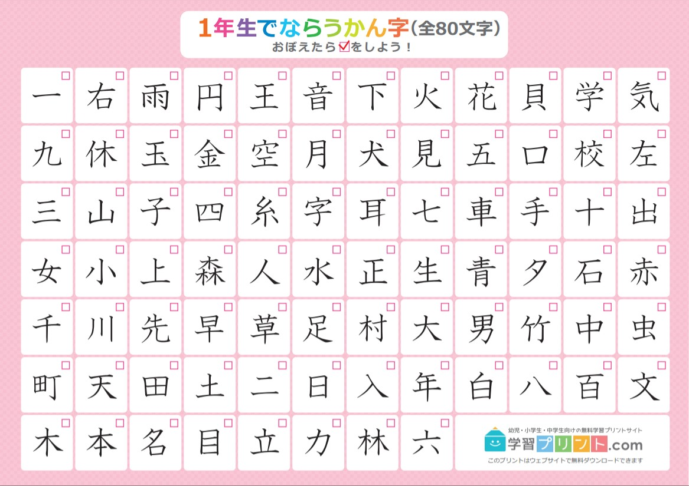

# Một hướng dẫn học Tiếng Nhật

## 1.1 Nhiều người học ngoại ngữ "thất bại" do đâu?

Hiện nay có rất nhiều người đã bắt đầu học các ngoại ngữ khác nhau vì những mục tiêu khác nhau. Dù vậy, không ít người sau nhiều năm học vẫn không thể đạt được mục tiêu ấy. Do việc học ngoại ngữ quá khó? Hay do chưa đủ chăm?

Phương pháp học tạo ra sự khác biệt rất lớn trong khả năng và tốc độ tiến bộ ngoại ngữ của bạn. Khó có thể đạt được những mục tiêu như vậy chỉ với các phương pháp học ngoại ngữ "truyền thống". Nhiều người "thất bại" vì thiếu vào một phần quan trọng, **Immersion**, trong quá trình học tập. **Immersion** để chỉ việc nghe hoặc đọc nội dung của người bản ngữ dành cho người bản ngữ. 

## 1.2 Vấn đề của phương pháp học truyền thống

{:  style="display: block; margin: 0 auto; max-width:40%; height:auto;" }  

Học ngoại ngữ theo phương pháp "truyền thống" thì thường sẽ kiểu như này:

-   Học bảng chữ cái (nếu cần)
-   Học các câu cơ bản như câu chào hỏi, tự giới thiệu.
-   Học cấu trúc ngữ pháp và từ vựng cơ bản.
-   Nghĩ ra câu bằng cách trò chuyện với giáo viên hoặc bạn học hoặc bằng cách viết.
-   Dịch các câu ví dụ từ Tiếng Việt sang ngôn ngữ đích (TL - Target Language) và ngược lại.
-   Tra cứu thêm tài liệu về cấu trúc ngữ pháp và từ vựng trong sách giáo khoa hoặc xem video YouTube
-   Thực hành hội thoại sử dụng kiến thức đã học.
-   Tích lũy thêm nhiều cấu trúc từ vựng và ngữ pháp và lấy số lượng làm thước đo cho sự tiến bộ của bản thân
- Giai đoạn cuối: Cố nói và viết để rèn luyện khả năng ngoại ngữ

Bản thân việc học như này hoàn toàn được, nhưng chưa đủ để giúp bạn đạt được trình độ cao. Vấn đề là những người học thuộc nhóm trên không tương tác với ngôn ngữ thực tế.

Lấy bơi lội làm ví dụ: Bạn không thể chỉ mãi ở hồ dành cho trẻ con, đeo phao và hy vọng rằng mình sẽ thành thạo kỹ thuật bơi trong cái hồ đó trước khi bước sang hồ lớn. Làm vậy sẽ không bao giờ khiến bạn trở thành một người biết bơi thực thụ. Cũng giống như bạn không thể trở thành vận động viên bơi lội chỉ bằng cách học lý thuyết và luyện động tác trên cạn, mà không bao giờ nhảy xuống nước thật.

Một ví dụ dễ liên hệ hơn: game đối kháng. Bạn sẽ không thể chơi giỏi chỉ bằng cách luyện với máy hoặc tập trong chế độ huấn luyện cả ngày. Muốn giỏi, bạn phải bước vào trận đấu thực sự – chơi với người thật, chấp nhận rằng mình có thể thua tơi tả. Đó mới là “chơi thật”.

  Điều quan trọng là: phải học cách bước tiếp

Người mới học thường mắc một lỗi là cố gắng học tài liệu cho đến khi hiểu hết mới thôi và không thực hiện Immersion vì chưa cảm thấy thoải mái hay "sẵn sàng". Tuy nhiên, cần ngừng sử dụng tài liệu cho người mới học càng sớm càng tốt vì trên thực tế, bạn sẽ không bao giờ cảm thấy sẵn sàng nếu không bắt đầu tiếp xúc với ngôn ngữ thực tế và làm quen với nó.

Chủ nghĩa cầu toàn có thể là con dao hai lưỡi trong việc học ngôn ngữ. Tốn quá nhiều thời gian và công sức mà không đạt được nhiều kết quả, cố ghi nhớ từng chi tiết nhỏ nhất của những thứ không thực sự quan trọng trong cả quá trình học dài đấy.

Học một ngôn ngữ giống như leo núi vậy. Bạn có thể cố gắng leo mà không dùng đến bất kỳ công cụ hỗ trợ nào – và dù sẽ rất vất vả, nếu kiên trì, bạn vẫn có thể đến đích. Việc học theo cách truyền thống giống như đang bện một sợi dây thừng để việc leo núi dễ hơn. Nhưng bạn không thể chỉ ngồi đó bện dây mãi – đến một lúc nào đó, bạn phải bắt đầu leo.

Dù bạn có làm ra bao nhiêu dây đi nữa, thì việc leo núi vẫn sẽ khó khăn và tốn thời gian. Không có đường tắt – bạn phải thực sự bắt tay vào *làm*.

## 1.3 Độ rộng của ngôn ngữ

Nó vượt xa hoàn toàn những giới hạn của việc học trong lớp hay qua các ứng dụng kiểu “x có nghĩa là y” hay “x dùng để y”. Nếu bạn muốn thật sự giỏi một ngôn ngữ, bạn cần một lượng trải nghiệm khổng lồ – đọc và nghe những gì người bản xứ thật sự nói, thật sự viết.

Và thường thì rất khó để hiểu tại sao họ lại dùng *câu đó* trong *tình huống kia*, hay *từ này* thay vì *từ kia*. Điều đó tạo nên một rào cản lớn cho người học – bởi vì bạn không thể chỉ học mỗi ngữ pháp và từ vựng mà mong nói được như người bản xứ.

Để thành thạo một ngôn ngữ ở cấp độ cao cần một số lượng thời gian lớn để **đọc** và **nghe** nội dung ngôn ngữ mục tiêu và từ đó hình thành lên _trải nghiệm ngôn ngữ_. Nếu không có những trải nghiệm cần thiết, việc cố gắng tự tạo câu ở ngôn ngữ mục tiêu thường khiến cho cách diễn đạt trở lên thiếu tự nhiên hoặc khó hiểu. Thêm nữa, việc không hiểu hoặc chưa hiểu rõ cách người bản ngữ sử dụng ngôn ngữ của họ khiến việc hiểu họ trở nên khó khăn hơn rất nhiều do không quen với cách diễn đạt bên ngoài phạm vi của tài liệu học tập.

Đây là lý do tại sao trong việc học ngoại ngữ cần có **"Immersion" - đọc và nghe những gì người bản ngữ viết và nói.**

Học ngôn ngữ là một quá trình ghi nhớ các thành phần trong vô thức thông qua Comprehensible Input. Điều này có nghĩa là, khi bạn hiểu điều gì đó (comprehensible) trong quá trình Immersion, bộ não của bạn sẽ vô thức lưu mẫu (pattern) đó vào để có thể sử dụng trong tương lai.

Tại sao lại không nói về "biết ngữ pháp" hay "nhớ từ vựng"? Bởi đây không phải là cách xử lý ngôn ngữ tự nhiên.

## 1.4 Chấp nhận cảm giác khó chịu và mù mờ

{:  style="display: block; margin: 0 auto; max-width:40%; height:auto;" }  

Trong việc học ngôn ngữ hay trong bất cứ lĩnh vực nào đòi hỏi kỹ năng, bạn sẽ luôn gặp khó khăn trong một thời gian dài cho đến khi bạn tiến bộ hơn. Như đã nói ở trên, nhiều người học (mình cũng đã từng như vậy) cứ cố gắng học thật tốt một thứ gì đó trước khi sử dụng thực tế.

Một người học có thể gặp vấn đề khi cố học một cấu trúc ngữ pháp nào đó quá lâu và không chuyển sang những nội dung khác mà họ nên học.

<h3>↑ Đây là điều chúng ta cần tránh</h3 >  

Cần phải học cách chấp nhận sự mù mờ khi học một ngôn ngữ, biết buông bỏ và bắt tay vào làm những gì chúng ta thực sự cần làm. Điều này hoàn toàn khác so với cách học ở trường lớp, nơi được tuyên dương dựa trên thành tích học và được xếp loại thông qua các tiêu chí hoặc các kỳ thi. 

Những người học ở trên dễ cảm thấy nản vì không hiểu được tất cả hoặc phần nhiều khi tương tác với ngôn ngữ thực tế, cho dù đó là một bộ phim truyền hình, hay một quyển sách hoặc thậm chí chỉ là một cuộc hội thoại bình thường với người bản ngữ. Việc tiếp tục như vậy khi bạn hiểu rất ít nghe có vẻ không hợp lí, nhưng như đã nói ở các phần trước, học một ngôn ngữ cũng giống như nhảy vào hố sâu bất tận vậy. Không dễ dàng gì để có thể hiểu hết quyển tiểu thuyết hay một bộ phim (dài tập) đó ngay lần đầu. Cần tới lần thứ ba, thứ tư, thứ năm và thậm chí thứ sáu để có thể học được điều gì đó.

Điều khiến việc học ngôn ngữ trở nên quá khác biệt so với các môn học ở trường là nó dựa trên việc sử dụng ngôn ngữ một cách tự nhiên và thực tế, thứ mà tài liệu học tập không thể truyền tải được. Vì vậy, cách duy nhất để làm quen với mọi thứ là chấp nhận sự mù mờ (low comprehension), vì càng tương tác với ngôn ngữ nhiều thì sẽ càng tiến bộ hơn.

Chúng ta không *chỉ* thực hiện Immersion mà không làm gì khác. Cũng cần học những thứ như ngữ pháp và từ vựng. Đồng thời, sử dụng từ điển để học từ trong quá trình Immersion.

## N

Đi du lịch Nhật để nói chuyện với người Nhật, xem anime không phụ đề, đọc manga và light novel bằng Tiếng Nhật đều yêu cầu bạn phải... _học Tiếng Nhật_. 

Chỉ riêng hướng dẫn này là không đủ để có thể *dạy* bạn Tiếng Nhật, nhưng ít nhất bạn sẽ có được định hướng để có thể tự mình học Tiếng Nhật.

## Hệ thống chữ viết Tiếng Nhật

Hệ thống chữ viết Tiếng Nhật bao gồm ba hệ thống chữ viết: hiragana, katakana và kanji.

### Kana

Hiragana và katakana, hay kana, là hai hệ thống chữ viết ngữ âm, mỗi bảng bao gồm 46 ký tự. 

Hiragana (ひらがな) được sử dụng cho các phần ngữ pháp và từ không có dạng kanji hoặc người viết chọn không sử dụng kanji. Katakana (カタカナ) được sử dụng cho các từ mượn và nhấn mạnh (tương tự như in nghiêng), cùng với các mục đích khác. Bạn có thể đọc thêm [Hiragana và Katakana: Hướng dẫn toàn diện cho người mới học](https://mochidemy.com/blog/hiragana-va-katakana/) được viết bởi Mochidemy.

### Kanji

Kanji là phần thứ ba của hệ thống chữ viết Tiếng Nhật.

Học sinh cao trung Nhật Bản (tương đương với học sinh THPT bên nước mình) cần phải học ít nhất 2136 Kanji trong chương trình học, nhưng có tới khoảng 3000 Kanji được sử dụng thường xuyên trong cuộc sống.

## Học Tiếng Nhật

### Ngữ pháp

Học ngữ pháp Tiếng Nhật tương đối đơn giản: Chọn một hướng dẫn ngữ pháp và đọc nó. Nếu học bằng Tiếng Anh thì có một số hướng dẫn ngữ pháp như Tae Kim hoặc Ammo Misa chẳng hạn

Bạn không nên cố ghi nhớ mọi thứ ngay lần đầu đọc trong bất kỳ hướng dẫn nào bạn chọn, và mục tiêu chính là ta cần phải *hiểu*. Mục đích của hướng dẫn ngữ pháp không phải là để giúp bạn "làm chủ" ngôn ngữ (điều này chỉ có được khi thực hành và tiếp xúc với ngôn ngữ đủ nhiều), mà chỉ đơn giản là giúp xây dựng những nguyên tắc cơ bản của ngôn ngữ và cung cấp cho bạn nền tảng mà bạn cần để bắt đầu đọc Tiếng Nhật.

Khi đã đọc hết hướng dẫn mà bạn chọn, bạn có thể bắt đầu đọc nội dung Tiếng Nhật và xem lại hướng dẫn để củng cố kiến thức nếu cần. Đọc Tiếng Nhật là một cách thực hành ngữ pháp *chủ động* (actively practicing) vì bạn cần ngữ pháp để hiểu những gì bạn đang đọc. Manga là một lựa chọn phổ biến cho những người mới bắt đầu tập đọc, ví dụ như [Yotsubato](https://en.wikipedia.org/wiki/Yotsuba%26!). Bạn cũng có thể sử dụng [Bộ thẻ ngữ pháp DoJG](http://dojgdeck.neocities.org/) để củng cố những gì bạn đã học.

Đây chưa phải là điểm kết thúc của việc học ngữ pháp. Bạn mới chỉ học xong *ngữ pháp cơ bản*. Bạn có thể (cá nhân mình gợi ý) học hết các cấu trúc ngữ pháp JLPT. Cá nhân mình gợi ý bạn học trên trang [Nihongo-Kyoshi: JLPT文法解説まとめ](https://nihongokyoshi-net.com/jlpt-grammars/) hoặc bất kì nguồn tài nguyên nào bạn muốn học.

### Từ vựng

[Anki](https://apps.ankiweb.net/) là một chương trình flashcard giúp bạn học và ghi nhớ từ vựng thông qua [SRS](https://en.wikipedia.org/wiki/Spaced_repetition). Khá nhiều người học Tiếng Nhật khi bắt đầu học Tiếng Nhật và sử dụng Anki sẽ lựa chọn sử dụng bộ thẻ Core đã được làm sẵn (Dao động từ khoảng 1500 - 2000 từ). 

Sau khi hoàn thành bộ thẻ Core, cá nhân mình gợi ý bạn bắt đầu xây dựng một bộ thẻ *mining* cho mình. Bộ thẻ *mining* hay **mining deck** là bộ thẻ từ vựng mà bạn tự tạo để học và ghi nhớ những từ (bạn chưa biết) mà bạn bắt gặp trong quá trình tiêu thụ Tiếng Nhật của mình. Tiện ích trình duyệt [Yomitan](https://yomitan.wiki/) giúp bạn tạo thẻ một cách đơn giản hơn nhiều bằng cách di chuột vào từ bạn chưa biết rồi bấm dấu **+** ở trong hộp thoại hiện lên.

### Học Kana và Kanji

Bạn sẽ cần phải học cả ba hệ thống chữ viết để có thể đọc được Tiếng Nhật. Với hiragana và katakana thì do có số lượng không nhiều và cách viết không quá phức tạp nên có thể học nhanh được. Đối với Kanji, do số lượng lớn và phức tạp nên có nhiều cách tiếp cận khác nhau.

Không có phương pháp nào được mô tả dưới đây vượt trội hơn một cách khách quan so với các phương pháp khác. Điều quan trọng nhất của bất kỳ phương pháp nào không phải là nó "hiệu quả" như thế nào mà là bạn có thích nó hay không, hay ít nhất là cảm thấy có đủ động lực để hoàn thành nó. Đừng ngại thử các phương pháp khác nhau và xem phương pháp nào phù hợp nhất với bạn.

Dưới đây sẽ là một số phương pháp mà bạn có thể thử và _không phương pháp nào là hơn phương pháp nào_. Phương pháp tốt nhất chính là phương pháp mà bạn thấy muốn học và học có hiệu quả với bạn. Bạn có thể thử xem phương pháp nào là bạn học vào đầu nhất.

### Về việc học Kanji đơn lẻ

Có hai cách chính để tiếp cận Kanji: 

- Đơn giản nhất là học cả từ mà không cần học từng chữ Kanji riêng lẻ. 
- Cách thứ hai là học từng Kanji một cách riêng biệt để tìm hiểu ý nghĩa và thành phần của nó. 

Học Kanji đơn lẻ có thể giúp bạn có khả năng viết tay và khiến việc học từ vựng trở nên dễ dàng hơn. 

Hãy nhớ rằng việc nhận dạng được mặt chữ và có thể tự viết ra là hai kĩ năng khác nhau. Thực hành việc này sẽ giúp cho việc kia dễ dàng hơn, ta cần luyện tập "nhận dạng" Kanji để có thể tăng khả năng nhận dạng Kanji và điều này cũng tương tự với việc tập tự viết.

### Học Kanji thông qua từ vựng

Nếu bạn chọn không học Kanji đơn lẻ, bạn vẫn sẽ học được cách nhận biết ý nghĩa và cách đọc của Kanji khi học từ mới. Dù sao đi nữa, học từ vựng mới là điều bạn cần phải làm, vì vậy nhiều người bỏ qua việc học kanji đơn lẻ. 

Cả hai phương pháp đều sẽ giúp bạn học được, miễn là bạn kiên trì. Vì vậy, việc lựa chọn cách học sẽ hoàn toàn do bạn. Nếu bạn không muốn học Kanji, bạn có thể chỉ học thông qua bộ thẻ từ vựng. Tuy nhiên, nếu bạn học từ vựng có Kanji chậm hoặc khó có thể ghi nhớ được từ, hãy cân nhắc việc học Kanji đơn lẻ.

### Cách ghi nhớ Kanji đơn lẻ

Phương pháp ghi nhớ sử dụng những câu chuyện ngắn hoặc sử dụng hình ảnh giúp cho việc học Kanji bớt khó khăn hơn nhiều. Một trong những bộ sách mà mình gợi ý là bộ [Hack não Kanji](https://www.youtube.com/c/Ti%E1%BA%BFngNh%E1%BA%ADt21Ng%C3%A0y) (Họ cũng có một danh sách các video bài giảng miễn phí trên Youtube cho những người không muốn đọc sách).

Bạn cũng có thể học Kanji một cách riêng biệt mà không cần sử dụng sách hay bất cứ các phương pháp ghi nhớ ở trên bằng cách sử dụng một bộ thẻ Anki. Bạn sẽ cần học bộ thủ trước. Điều duy nhất bạn cần tập trung trong quá trình học Kanji đơn lẻ là học từng chữ Kanji với ý nghĩa và âm Hán Việt của nó.

Một trong những sai lầm phổ biến mà nhiều người mới học mắc phải là bạn học cách phát âm của Kanji (a.k.a âm kun, âm on). Việc học như vậy là **HOÀN TOÀN SAI** vì sẽ có nhiều cách phát âm khác nhau và trong các từ vựng khác nhau sẽ có cách phát âm khác nhau. Một thống nhất chung là cách đọc Kanji chỉ nên được học thông qua từ vựng. Bạn có thể đọc bài viết [Learning Kanji](http://learnjapanese.moe/kanji/) và xem [You Don’t Have to Study Kanji](https://www.youtube.com/watch?v=exkXaVYvb68) để tìm hiểu thêm.

### Cách học bộ thủ

Bạn sẽ có hai bước sau:

1. Học bộ thủ thông qua video [185 BỘ THỦ CƠ BẢN trong tiếng Nhật](https://www.youtube.com/watch?v=7M1A2IGUwuM) để hiểu trước đã.
2. Sử dụng một bộ thẻ Anki để ghi nhớ. Cá nhân mình sử dụng [Bộ Thủ Chữ Hán (Tiếng Nhật)](https://ankiweb.net/shared/info/1364084349)

## Vậy thì mình cần làm gì để học Tiếng Nhật?

Trong hướng dẫn dưới dây mình sẽ cần immerse Tiếng Nhật. **Immerse** (động từ) hay **Immersion** (danh từ) là việc thu thập thật nhiều đầu vào (Input), nói cách khác là phải nghe và đọc thật nhiều nội dung như tin tức, phim, video, sách, truyện tranh... bằng ngôn ngữ bạn đang học (Trong ngữ cảnh này thì là Tiếng Nhật). 

Quá trình học dưới đây về cơ bản sẽ là học kiến thức Tiếng Nhật là dành thời gian để tiêu thụ nội dung Tiếng Nhật càng nhiều càng tốt, và ta cũng sẽ học Tiếng Nhật từ chính nội dung ta tiêu thụ (xem, nghe, đọc) - một vòng lặp học tập. Càng tiếp tục thực hiện vòng lặp này thì kĩ năng Tiếng Nhật của bạn sẽ càng giỏi.

1. **Học và luyện tập Kana** thông qua [DJT Kana](https://djtguide.neocities.org/kana/index.html). Bạn cần phải nắm chắc Hiragana trước khi sang bước tiếp theo, Katakana cũng quan trọng nhưng bạn chưa cần phải học kĩ ngay bây giờ để có thể bắt đầu sang bước sau. 
2. **Thiết lập Anki và sử dụng bộ thẻ từ vựng cơ bản**. Một trong những bộ thẻ từ vựng cá nhân mình gợi ý là bộ [Kaishi1.5k](https://ankiweb.net/shared/info/1196762551) (Bạn cũng có thể sử dụng bộ [Kaishi1.5k Tiếng Việt](https://github.com/duy103zxc/kaishi-vi/releases)).
3. **Nếu bạn muốn học Kanji hoặc bộ thủ đơn lẻ**, quay lại lên trên bài viết và đọc phần học Kanji. Bạn có thể học trước khi bắt đầu học từ vựng hoặc học cả hai cùng lúc đều được. Nhưng bạn nên cố hoàn thành sau một vài tháng để có thể tập trung vào việc học từ vựng.  
4. Vì bạn sẽ học từ vựng, ngữ pháp với immerse trong quá trình học, bạn nên học cách đi từng bước, giữ nhịp học ổn định (xây dựng thói quen học). Tuy nhiên, điều này không có nghĩa là bạn không nên thúc đẩy bản thân. Bạn có thể thay đổi số lượng thẻ mới mỗi ngày trong Anki. Khi mới bắt đầu học, hãy để mặc định là 20 và xem bạn có theo được không. Bạn có thể tăng số lượng thẻ nếu bạn thấy mình có thể học thêm và giảm số lượng thẻ xuống nếu bạn cảm thấy quá tải. Khi bắt đầu đi vào vòng lặp ổn định, tổng số thẻ cần ôn tập của bạn sẽ gấp khoảng 10 lần số lượng thẻ mới mỗi ngày (Nếu bạn học 20 thẻ mới mỗi ngày thì bạn cần ôn khoảng 200 thẻ mỗi ngày).
5. Để học ngữ pháp, bạn có thể bắt đầu bằng [Hướng dẫn ngữ pháp của Tae Kim](http://www.guidetojapanese.org/learn/grammar) hoặc [Tiếng Nhật hữu cơ](https://thu-tram.github.io/tieng-nhat-huu-co) hay bất kì hướng dẫn nào bạn muốn học.
6. Khi bạn đã đọc xong hướng dẫn ngữ pháp cơ bản mà bạn đã chọn, bạn đã sẵn sàng để bắt đầu đọc Tiếng Nhật. Việc đọc sẽ trở nên dễ dàng hơn nếu bạn đã học được khoảng 1000–2000 từ vựng (Có thể thông qua bộ thẻ **Kaishi1.5k** ở trên) vào thời điểm này (dù sao bạn cũng sẽ phải tra rất nhiều từ, nhưng có vốn từ vựng cơ bản sẽ giúp bạn đỡ mệt hơn).  
7. Bắt đầu xây dựng bộ thẻ mining sau khi hoàn thiện phần từ mới ở bộ thẻ **Kaishi1.5k** (hoặc bộ thẻ từ vựng cơ bản mà bạn chọn). Bộ thẻ mining là bộ thẻ từ vựng mà bạn thêm những từ bạn không biết mà bạn bắt gặp khi đọc. Bạn nên sử dụng Yomitan để giúp cho việc thêm thẻ từ vựng dễ dàng hơn. 
8. **Thực hiện Immersion**: Trong quá trình khi mới bắt đầu đọc, mình gợi ý bạn dành thời gian cho việc nghe nhiều nhất có thể (Việc nghe sẽ giúp bạn phát triển kĩ năng ngôn ngữ tự nhiên và cải thiện khả năng nói và phát âm Tiếng Nhật của bạn). Khi mới bắt đầu thì mình gợi ý để tỉ lệ **nghe:đọc** là **7:3**, về sau bạn có thể nâng lên là **5:5**.
9. **Đọc nhiều hơn**: Ban đầu việc đọc sẽ rất chậm do ta chưa quen với Tiếng Nhật viết. Nhưng cách để đọc nhanh hơn là **đọc nhiều hơn** và cách để tăng khối lượng từ vựng cũng là **đọc nhiều hơn**
10. Tiếp tục immerse (nghe và đọc) thật nhiều đồng thời output (nói, viết) thường xuyên. 
11. Làm bất kì điều gì bạn muốn với ngôn ngữ. Ví dụ như thi JLPT chẳng hạn

Hướng dẫn ở trên khá tóm lược, mình khuyến khích bạn nên đọc thêm về hướng dẫn học Tiếng Nhật:

- [TheMoeWay](http://learnjapanese.moe/)
- [donkuri](https://donkuri.github.io/learn-japanese/guide/)

### Tài nguyên

Bạn có thể đọc trang tổng hợp tài nguyên tự học trong trang [Tài nguyên học](resources.md)

### Nguồn bài viết

Hướng dẫn này được dịch từ [hướng dẫn của DJT](https://djtguide.neocities.org/guide) và được chỉnh sửa lại nội dung kha khá.
