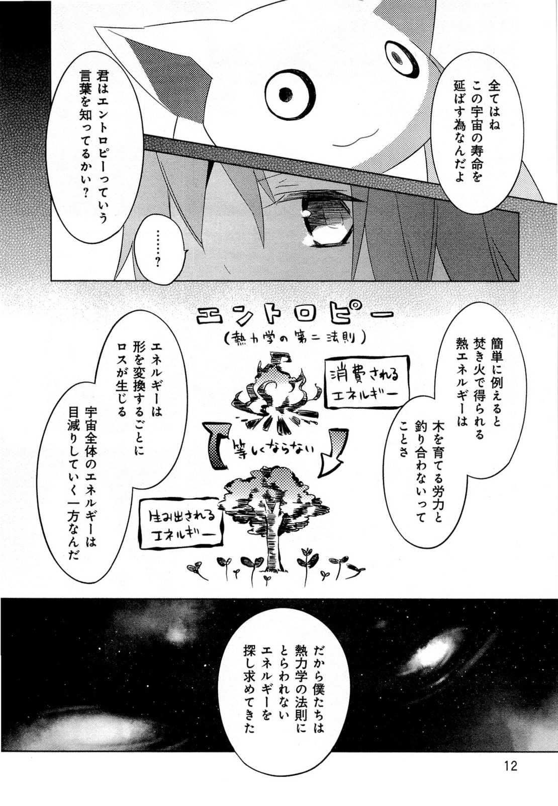
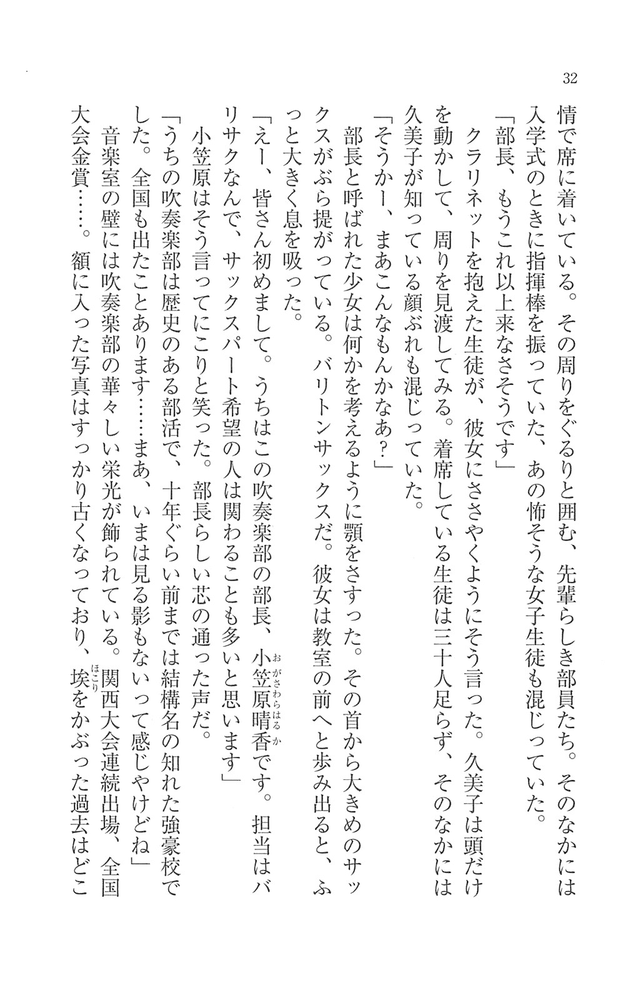
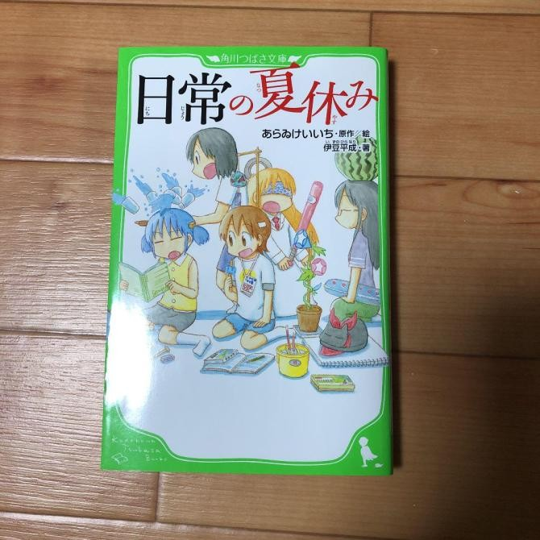
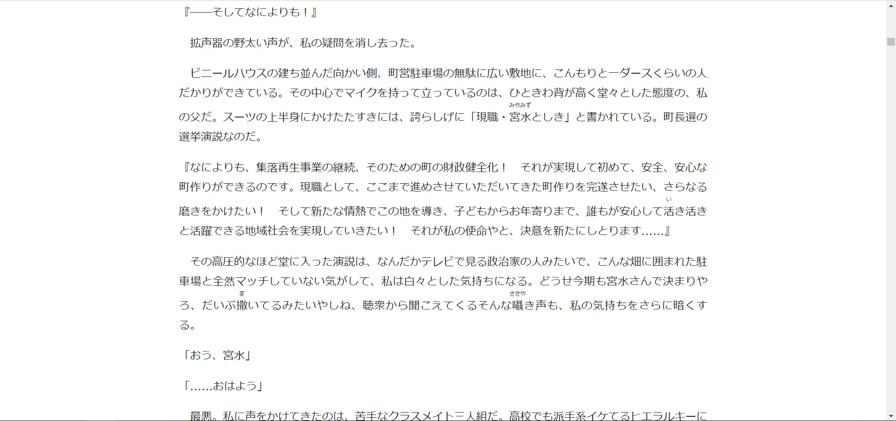

# Light Novel/Web Novel

!!! info "Nguồn"
    Viết bởi shoui, [Reading](https://github.com/shoui520/shoui520.github.io/blob/master/docs/reading.md)

Mình gộp chung vào và thành một bài về đọc Tiếng Nhật.

Đọc tiếng Nhật là ***CỰC KỲ QUAN TRỌNG***. Việc bạn học đọc là điều bắt buộc. Nhiều người hay hỏi: “Tôi có thể học tiếng Nhật mà không cần học đọc được không?” – Câu trả lời là: được, nếu bạn chấp nhận không hiểu nổi ngữ pháp cơ bản và sau nhiều năm học vẫn chỉ nhớ lèo tèo vài từ vựng.

Dĩ nhiên, đọc tiếng Nhật lúc đầu sẽ rất khó – đầy rẫy những chữ Hán nhìn là muốn bỏ cuộc. Nhưng đó là chuyện bình thường. Lúc đầu bao giờ cũng thấy mệt, bạn chỉ cần vượt qua giai đoạn đó, rồi dần dần sẽ đọc tốt hơn, tự tin hơn. Nếu bạn đang tự hỏi “Ủa rồi tra nghĩa mấy từ này kiểu gì?”, thì cứ yên tâm – có những công cụ hỗ trợ bạn rất hiệu quả.

Trước khi bước vào đọc thực sự, bạn nên học xong một bộ từ vựng Anki sẵn có (chẳng hạn như Kaishi 1.5k) và một giáo trình ngữ pháp cơ bản như của Tae Kim hay Cure Dolly – như vậy khi đọc sẽ đỡ đau đầu hơn vì bạn đã quen nhiều từ. Ngoài ra, bạn nên có trải nghiệm nghe tiếng Nhật trước đó, vì:

1. Nó giúp bạn tránh phát âm sai về lâu dài
2. Nó giúp bạn dễ hiểu cấu trúc câu hơn khi đọc.

### Những điểm mấu chốt

1. Học đọc lúc đầu bao giờ cũng khó. Đừng chờ tới khi “sẵn sàng” mới đọc – vì bạn sẽ không bao giờ thấy sẵn sàng nếu chưa bắt đầu.
2. Không nên bắt đầu đọc nếu chưa từng nghe tiếng Nhật. Hãy để tai bạn quen với ngôn ngữ này trước, rồi khi đọc bạn sẽ dễ tưởng tượng âm thanh trong đầu hơn.
3. Đừng quá lo nếu có câu đọc mãi mà không hiểu. Hãy học cách **chấp nhận sự mơ hồ**. Càng đọc nhiều, bạn sẽ càng hiểu được thôi.
4. Nếu bạn không thích đọc sách, thì có thể chơi visual novel hoặc đọc manga – cũng rất hiệu quả.
5. Cuốn light novel/sách đầu tiên lúc nào cũng sẽ là cuốn khó nhất. Hãy vượt qua nó, dù có mất bao lâu đi nữa.
6. Đừng vội vàng. Học theo tốc độ của chính mình. Nếu bạn ép mình quá mức, bạn sẽ chán và bỏ cuộc luôn đấy.

## Học cách đọc

Như đã nói, trước khi bắt đầu đọc, bạn cần có vốn từ cơ bản (đã hoàn thành một bộ Anki sơ cấp) và nắm được ngữ pháp tiếng Nhật – như vậy việc đọc sẽ nhẹ nhàng hơn nhiều.

### Manga

Manga là cách dễ tiếp cận nhất để bắt đầu đọc tiếng Nhật mà không quá áp lực. Văn phong trong manga gần với tiếng nói hằng ngày nên nếu bạn đã nghe quen, đọc sẽ dễ tiếp cận hơn. Nếu chưa quen? Cứ đọc manga và xem anime rồi sẽ quen.

*Manga: Mahou Shoujo Madoka Magica*

Như bạn thấy, manga dùng cả hiragana, katakana và kanji – nên rất tốt để luyện cả ba.

Nhưng mà tra từ kiểu gì, khi manga chỉ là... tranh?

Có thể sử dụng một số công cụ sau:

* PC: [Poricom](https://github.com/bluaxees/Poricom) – hỗ trợ tra từ từ ảnh manga.
* Android: [OCR Manga Reader](https://sourceforge.net/projects/ocrmangareaderforandroid/)
* iOS: [Kantan Manga Reader](https://apps.apple.com/gb/app/kantan-manga/id1518666365)

Lúc đầu đọc manga cũng sẽ rất khó, nhưng càng đọc nhiều thì sẽ càng quen và nhanh hơn.

### Light Novel/Web Novel

> Phân biệt qua cho ai chưa biết (Lấy từ [TensuraVN](https://www.facebook.com/TensuraVN/posts/2856482067753269/)):
> 
> - **Web Novel**: là bản tác giả đăng trên mạng đầu tiên, nói chung là bản nháp của tác giả. Nó sẽ là một cái khung cốt truyện của bộ
> - **Light Novel**: là bản hoàn chỉnh, được chăm chuốt, sửa đổi có thể là ít hoặc nhiều so với bản WN. Và cốt truyện cx sẽ theo như WN, hoặc không, có thể sẽ thêm nhân vật mới, tình tiết mới. Và nó giúp cho tác giả kiếm ra tiền.
>
> Cá nhân mình hay đọc WN hơn vì nó miễn phí, đọc trên Syosetu hoặc Kakuyomu đều được.

Dù bạn có đọc 100 manga đi nữa, thì bạn vẫn cần đọc tiểu thuyết. Vì trong văn viết có rất nhiều từ khác biệt với lời nói thường ngày. Nhưng đừng lo, tiếng Nhật văn học không đáng sợ như bạn tưởng – chỉ khác lời nói một chút thôi, đọc vài cuốn là quen ngay.

Để đọc light novel, bạn nên cài đặt *Yomitan*.

Quyển light novel đầu tiên sẽ đúng kiểu hành xác. Nhưng cuốn thứ hai sẽ đỡ hơn nhiều. Lúc mới bắt đầu, bạn có thể mất 1–3 tháng để đọc xong một cuốn. Nhưng về sau sẽ nhanh hơn (mình đọc xong một cuốn trong khoảng 10 tiếng).

Chỉ cần đọc nhiều thôi. Đọc càng nhiều thì càng giỏi.

Không nên đọc bản scan hay sách giấy nếu bạn không có cách tra từ – rất bất tiện.

Ghi chú: mình không có ác cảm gì với chữ dọc (縦書き), nhưng hình bên dưới là bản *scan*.

*Tiểu thuyết: Hibike! Euphonium*

*Tiểu thuyết: Nichijou no Natsuyasumi*

Bạn cần đọc những dạng như thế này:

*Tiểu thuyết: Kimi no Na wa.* (Bấm vào ảnh để phóng to)

Đây là bản **số hóa** – rất quan trọng. Vì bạn có thể bôi đen chữ và tra nghĩa bằng Yomitan.

### Visual Novel

*Visual Novel: Angel Beats! -1st beat-*

Visual novel cực kỳ hữu ích nếu bạn không thích đọc sách. Nó giống như xem anime có phụ đề tiếng Nhật vậy – rất tốt để luyện nghe-kết-hợp-đọc. Ngoài ra bạn có thể tạo [AnimeCards](https://www.animecards.site) từ đây.

Nếu bạn là người dễ mất tập trung khi đọc sách, thì visual novel chính là cứu cánh.

Chỉ cần nhớ cài sẵn phần mềm để lấy text từ game (texthook), hướng dẫn cài đặt tại [đây](vn.md).

Muốn giỏi đọc visual novel? Cứ đọc nhiều. Càng đọc nhiều, càng giỏi.

## Kết luận

Đừng lo lắng mình “biết bao nhiêu chữ Hán”. Chỉ cần bạn đã nghe quen tiếng Nhật và học qua ngữ pháp cơ bản là đủ để bắt đầu đọc rồi.

Đừng chần chừ. Đừng nghĩ “mình chưa sẵn sàng” – vì nếu bạn không bắt đầu, bạn sẽ chẳng bao giờ sẵn sàng cả.

Hãy đọc thật nhiều – đó là cách duy nhất để giỏi đọc. Không có mẹo vặt, không có lối tắt. Xin lỗi nếu bạn đang mong chờ điều gì đó kỳ diệu hơn.

Chúc bạn vui vẻ khi đắm mình trong thế giới tiếng Nhật! 😊