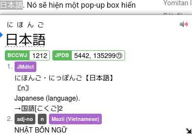

# Hướng dẫn cài đặt Yomitan

## Yomitan là gì?
Yomitan là một extension (tiện ích mở rộng) trên trình duyệt (Chrome, Chromium-based hoặc Firefox) cho phép bạn tra cứu các từ Tiếng Nhật cả nghĩa lẫn cách đọc trên trang web một cách dễ dàng.

## Bắt đầu
Yomitan có thể tải ở trên cả Chromium và Firefox.

Tải tại đây:

- [Chrome Web Store](https://chromewebstore.google.com/detail/yomitan/likgccmbimhjbgkjambclfkhldnlhbnn) - Cho các trình duyệt như Chrome, Chromium, Brave, Edge hoặc bất kì trình duyệt nào dựa trên nhân Chromium
- [Firefox](https://addons.mozilla.org/en-GB/firefox/addon/yomitan/) - Cho Firefox hay các trình duyệt dựa trên Firefox như Librewolf hoặc Waterfox.

Sau khi cài xong nó sẽ mở một tab mới, bạn đóng trang đó lại và tìm Yomitan trong phần "Tiện ích mở rộng" trong trình duyệt (Hoặc Addons cho Firefox).

## Tải từ điển

Khi bạn mới cài Yomitan lần đầu, bạn sẽ cần cài từ điển để có thể sử dụng được Yomitan.

Những tệp này sử dụng phần mở rộng `.zip` (file extension) và **bạn không cần phải giải nén nó ra.**
  
### Từ điển Nhật - Anh

Gợi ý từ người dịch: Bạn nên tải cả bộ Nhật - Anh ở dưới để bao quát lượng từ hơn và có thêm nhiều cái hay nữa.

Bạn có thể tải bộ từ điển từ tác giả gốc của bài viết này: [Bộ sưu tập từ điển Yomitan của Shoui](https://learnjapanese.link/dictionaries). Một số đường dẫn cho các từ điển khác bao gồm:

- [KanjiDictVN](https://github.com/trungnt2910/KanjiDictVN/releases)
- [Mazii Nhật - Việt](https://github.com/PainterHalver/mazii_to_yomichan/releases/)

Tải từ điển trong các thư mục tương ứng (Bilingual - Từ điển song ngữ Nhật - Anh, Kanji, Grammar .etc.) 

Bạn nên cài đặt các từ điển sau (theo shoui):

- `Bilingual/[Bilingual] Jitendex (Recommended).zip`  
- `Mazii Nhật - Việt.zip`
- `Kanji/[Kanji] KanjiDictVN.zip`  
- `Grammar/Dictionary of Japanese Grammar.zip`  
- `Pitch Accent/アクセント辞典v2 (Recommended).zip`

## Cài đặt từ điển và sử dụng cơ bản
  
1. Bấm vào  icon trên thanh công cụ của trình duyệt.  
2. Bấm vào  icon để mở cài đặt.  
3. Chọn "Dictionaries" ở thanh sidebar bên trái rồi chọn "Configure installed and enabled dictionaries…"  
4. Bấm vào nút "Import" ở bên dưới.  
5. Giờ là lúc chọn các từ điển để import vào trong Yomitan

    - `Bilingual/[Bilingual] Jitendex (Recommended).zip`  
    - `Mazii Nhật - Việt.zip`
    - `Kanji/[Kanji] KanjiDictVN.zip`  
    - `Grammar/Dictionary of Japanese Grammar.zip`  
    - `Pitch Accent/アクセント辞典v2 (Recommended).zip`

6. Đợi các từ điển được thêm vào. Sẽ mất một lúc (Mình làm trên Firefox thấy lâu hơn so với bên Chromium)
7. Sau khi hoàn tất, bạn có thể kiểm tra Yomitan bằng cách giữ phím ++shift++ và di chuột qua văn bản Tiếng Nhật. Thử di chuột vào cái này xem: 日本語. Nó sẽ hiện một pop-up box hiển thị các định nghĩa được chia theo từ điển.
 

Bấm ra chỗ khác trên màn hình hoặc phím Esc để ẩn hộp thoại đó đi

Nếu bạn cần đọc Kanji riêng cho từng từ thì bấm vào Kanji đó (Phải tải từ điển KANJIDIC hoặc KanjiDictVN)

Bạn có thể bấm vào nút  để nghe phát âm từ.

Trên thanh công cụ trình duyệt, nếu bạn chọn biểu tượng Yomitan, sau đó chọn biểu tượng  hoặc dùng tổ hợp phím tắt `Alt+ Insert`, bạn có thể truy cập vào "Yomitan Search" - bạn có thể sử dụng Yomitan như một từ điển Tiếng Nhật riêng (Hoàn toàn Offline).
 
Có thể chỉnh kích cỡ Pop-up trong cài đặt và cả giao diện tối nữa.

**Jitendex** là từ điển Nhật-Anh, được xây dựng dựa trên JMDict và lấy câu ví dụ từ dự án Tatoeba.

**新和英** (Shinwaei) Từ điển Nhật-Anh được làm cho người Nhật, có nhiều câu ví dụ

**KANJIDIC** Từ điển Kanji.

**Dictionary of Japanese Grammar**, or 日本語文法辞典(全集) - từ điển ngữ pháp

**アクセント辞典v2** Tra thông tin Pitch Accent

## Từ điển đo độ phổ biến của từ

Yomitan hỗ trợ từ điển tần suất để cho bạn biết độ phổ biến của từ này

**JPDB** - Danh sách làm bởi JPDB, tổng hợp từ light novels, visual novels, Anime and j-drama. 

**CC100** - Danh sách tần suất các từ xuất hiện trên Internet của Nhật, các từ trang . Ví dụ: 審議会 (council) có độ phổ biến 9733 trong CC100 và 58730 trong JPDB.  

**Thế nào là từ phổ biến?**  

Rất phổ biến: 1-10,000  
Phổ biến: 10,001-20,000    
Tương đối phổ biến: 20,001-30,000   
Chắc là phổ biến: 30,001-40,000  
Không phổ biến: 40,001-50,000  
Hàng hiếm: 50,001-80,000  
Người-bản-ngữ-chắc-cũng-không-biết: 80,000+  

## Cài đặt Anki

Đọc trên trang của [kuri](https://donkuri.github.io/learn-japanese/setup/#anki-setup).

## Server audio ngoại tuyến (Nhiều audio hơn mặc định)

[Đọc hướng dẫn tại đây](https://github.com/themoeway/local-audio-yomichan)  

!!! info "Nhắc nhỏ"
    Phần còn lại của bài viết sẽ không được dịch nên bạn cần đọc ở trang gốc bằng Tiếng Anh
